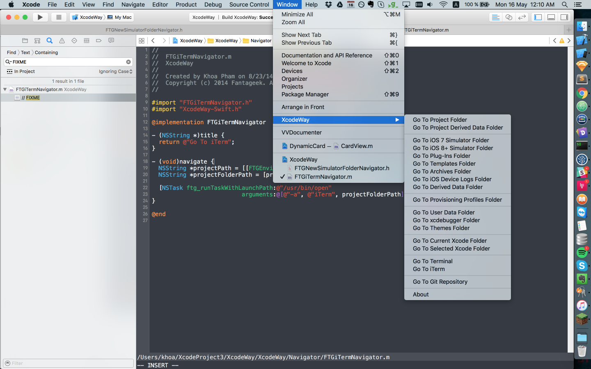

XcodeWay
==
Navigate to many places from Xcode. Available as Xcode Source Editor Extension


Features
==

- XcodeWay
  - Help navigate to many places
  - Available via `Editor -> XcodeWay`
- XcodeWay+Commands
  - Useful commands
  - Available via `Editor -> XcodeWay+Commands`



### Navigators

- Go To Project Folder
- Go To Project Derived Data Folder
- Go To iOS 7 Simulator Folder
- Go To iOS 8+ Simulator Folder
- Go To Plugins Folder
- Go To Templates Folder
- Go To Archives Folder
- Go To iOS Device Logs Folder
- Go To Derived Data Folder
- Go To Provisioning Profile Folder
- Go To User Data Folder
  - Go To Themes Folder
  - Go to xcdebugger Folder
- Go To Current Xcode Folder
- Go To Selected Xcode Folder
- Go To iTerm with current project opened
- Go To Terminal with current project opened
- Go To Git Repositories

### Commands

- List top files with most lines
- List top assets with largest sizes
- Show FIXME, TODO warnings
- List dynamic libraries sizes
- Reload Xcode bundles
- Show Xcode `DVTPlugInCompatibilityUUID`

### Extensible

Add your own Navigator by conforming to `Navigator`

```swift
@objc protocol Navigator: NSObjectProtocol {
  func navigate()
  var title: String { get }
}
```

## Installation

- Run `sudo /usr/libexec/xpccachectl` and restart Mac
- Build the project

## Troubleshooting

- Stop `com.apple.dt.Xcode.AttachToXPCService`
- It only works when a Swift file is selected
- If the menu is disappeared or disabled, run again

Licence
--
This project is released under the MIT license. See LICENSE.md.
